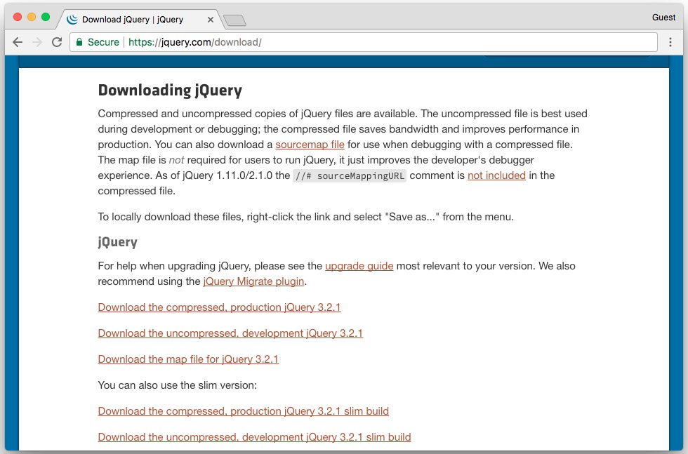
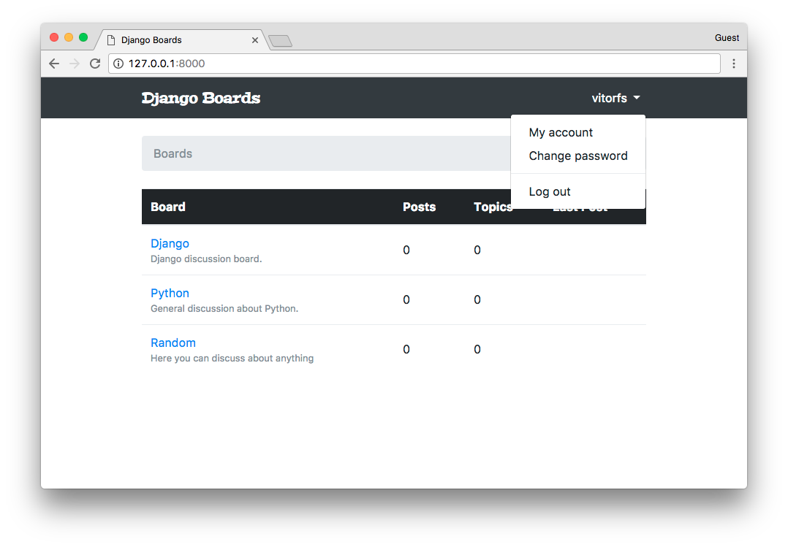
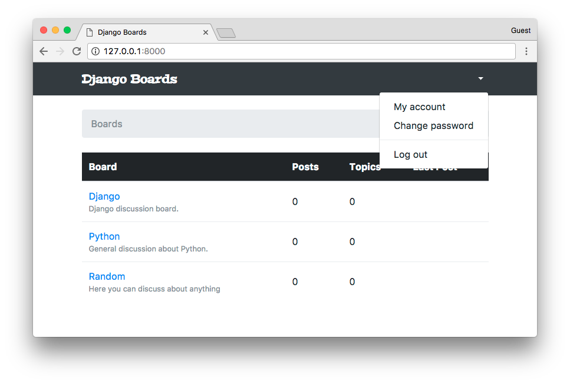

# Django入门与实践-第15章：用户注销

为了在实现过程保持完整自然流畅的功能，我们还添加注销视图，编辑**urls.py**以添加新的路由：

**myproject/urls.py**

```python
from django.conf.urls import url
from django.contrib import admin
from django.contrib.auth import views as auth_views

from accounts import views as accounts_views
from boards import views

urlpatterns = [
    url(r'^$', views.home, name='home'),
    url(r'^signup/$', accounts_views.signup, name='signup'),
    url(r'^logout/$', auth_views.LogoutView.as_view(), name='logout'),
    url(r'^boards/(?P<pk>\d+)/$', views.board_topics, name='board_topics'),
    url(r'^boards/(?P<pk>\d+)/new/$', views.new_topic, name='new_topic'),
    url(r'^admin/', admin.site.urls),
]

```



我们从Django的contrib模块导入了**views** ，我们将其更名为**auth_views** 以避免与**boards.views**发生冲突。注意这个视图有点不同： `LogoutView.as_view()`。这是一个Django的“基于类”的视图，到目前为止，我们只将类实现为python函数。基于类的视图提供了一种更加灵活的方式来扩展和重用视图。稍后我们将讨论更多这个主题。

打开**settings.py**文件，然后添加`LOGOUT_REDIRECT_URL`变量到文件的底部：

**myproject/settings.py**

```
LOGOUT_REDIRECT_URL = 'home'

```

在这里我们给变量指定了一个URL模型的名称，以告诉Django当用户退出登录之后跳转的地址。

在这之后，这次重定向就算完成了。只需要访问URL **127.0.0.1:8000/logout/** 然后您就将被注销。但是再等一下，在你注销之前，让我们为登录用户创建下拉菜单。

------

#### 为登录用户显示菜单

现在我们需要在 **base.html**模板中进行一些调整。我们必须添加一个带注销链接的下拉菜单。

Bootstrap 4 下拉组件需要jQuery才能工作。	 

首先，我们前往 [jquery.com/download/](https://jquery.com/download/)，然后下载压缩的 jQuery 3.2.1版本。



在静态文件夹中，创建一个名为js的新文件夹。将jquery-3.2.1.min.js文件复制到那里。

Bootstrap4还需要一个名为**Popper** 的库才能工作，前往 [popper.js.org](https://popper.js.org/) 下载它的最新版本。

在**popper.js-1.12.5**文件夹中，转到**dist/umd**并将文件**popper.min.js** 复制到我们的**js** 文件夹。这里注意，敲黑板！Bootstrap 4只能与 **umd/popper.min.js**协同工作。所以请确保你正在复制正确的文件。

如果您不再拥有 Bootstrap 4文件，请从[getbootstrap.com](http://getbootstrap.com/).再次下载它。

同样，将 **bootstrap.min.js**文件复制到我们的js文件夹中。最终的结果应该是：

```shell
myproject/
 |-- myproject/
 |    |-- accounts/
 |    |-- boards/
 |    |-- myproject/
 |    |-- static/
 |    |    |-- css/
 |    |    +-- js/
 |    |         |-- bootstrap.min.js
 |    |         |-- jquery-3.2.1.min.js
 |    |         +-- popper.min.js
 |    |-- templates/
 |    |-- db.sqlite3
 |    +-- manage.py
 +-- venv/

```

在**base.html**文件底部，在后面添加脚本：

**templates/base.html**

```html
<!DOCTYPE html>
<html>
  <head>
    <meta charset="utf-8">
    <title>Django Boards</title>
    <link href="https://fonts.googleapis.com/css?family=Peralta" rel="stylesheet">
    <link rel="stylesheet" href="">
    <link rel="stylesheet" href="">
    
  </head>
  <body>
    
    <!-- code suppressed for brevity -->
    
    <script src=""></script>
    <script src=""></script>
    <script src=""></script>
  </body>
</html>
```

如果你发现上面的说明很模糊，只需要直接在下面的链接下载文件

- <https://code.jquery.com/jquery-3.2.1.min.js>
- <https://cdnjs.cloudflare.com/ajax/libs/popper.js/1.11.0/umd/popper.min.js>
- <https://maxcdn.bootstrapcdn.com/bootstrap/4.0.0-beta/js/bootstrap.min.js>

打开链接，右键另存为

现在我们可以添加Bootstrap4下拉菜单了：

**templates/base.html**

```html
<nav class="navbar navbar-expand-sm navbar-dark bg-dark">
  <div class="container">
    <a class="navbar-brand" href="">Django Boards</a>
    <button class="navbar-toggler" type="button" data-toggle="collapse" data-target="#mainMenu" aria-controls="mainMenu" aria-expanded="false" aria-label="Toggle navigation">
      <span class="navbar-toggler-icon"></span>
    </button>
    <div class="collapse navbar-collapse" id="mainMenu">
      <ul class="navbar-nav ml-auto">
        <li class="nav-item dropdown">
          <a class="nav-link dropdown-toggle" href="#" id="userMenu" data-toggle="dropdown" aria-haspopup="true" aria-expanded="false">
            {{ user.username }}
          </a>
          <div class="dropdown-menu dropdown-menu-right" aria-labelledby="userMenu">
            <a class="dropdown-item" href="#">My account</a>
            <a class="dropdown-item" href="#">Change password</a>
            <div class="dropdown-divider"></div>
            <a class="dropdown-item" href="">Log out</a>
          </div>
        </li>
      </ul>
    </div>
  </div>
</nav>

```



我们来试试吧，点击注销：



现在已经成功显示出来了，但是无论用户登录与否，下拉菜单都会显示。不同的是在未登录时用户名显示是空的，我们只能看到一个箭头。

我们可以改进一点：

```html
<nav class="navbar navbar-expand-sm navbar-dark bg-dark">
  <div class="container">
    <a class="navbar-brand" href="">Django Boards</a>
    <button class="navbar-toggler" type="button" data-toggle="collapse" data-target="#mainMenu" aria-controls="mainMenu" aria-expanded="false" aria-label="Toggle navigation">
      <span class="navbar-toggler-icon"></span>
    </button>
    <div class="collapse navbar-collapse" id="mainMenu">
      
        <ul class="navbar-nav ml-auto">
          <li class="nav-item dropdown">
            <a class="nav-link dropdown-toggle" href="#" id="userMenu" data-toggle="dropdown" aria-haspopup="true" aria-expanded="false">
              {{ user.username }}
            </a>
            <div class="dropdown-menu dropdown-menu-right" aria-labelledby="userMenu">
              <a class="dropdown-item" href="#">My account</a>
              <a class="dropdown-item" href="#">Change password</a>
              <div class="dropdown-divider"></div>
              <a class="dropdown-item" href="">Log out</a>
            </div>
          </li>
        </ul>
      
        <form class="form-inline ml-auto">
          <a href="#" class="btn btn-outline-secondary">Log in</a>
          <a href="" class="btn btn-primary ml-2">Sign up</a>
        </form>
      
    </div>
  </div>
</nav>

```

现在，我们告诉Django程序，要在用户登录时显示下拉菜单，如果没有，则显示登录并注册按钮：



