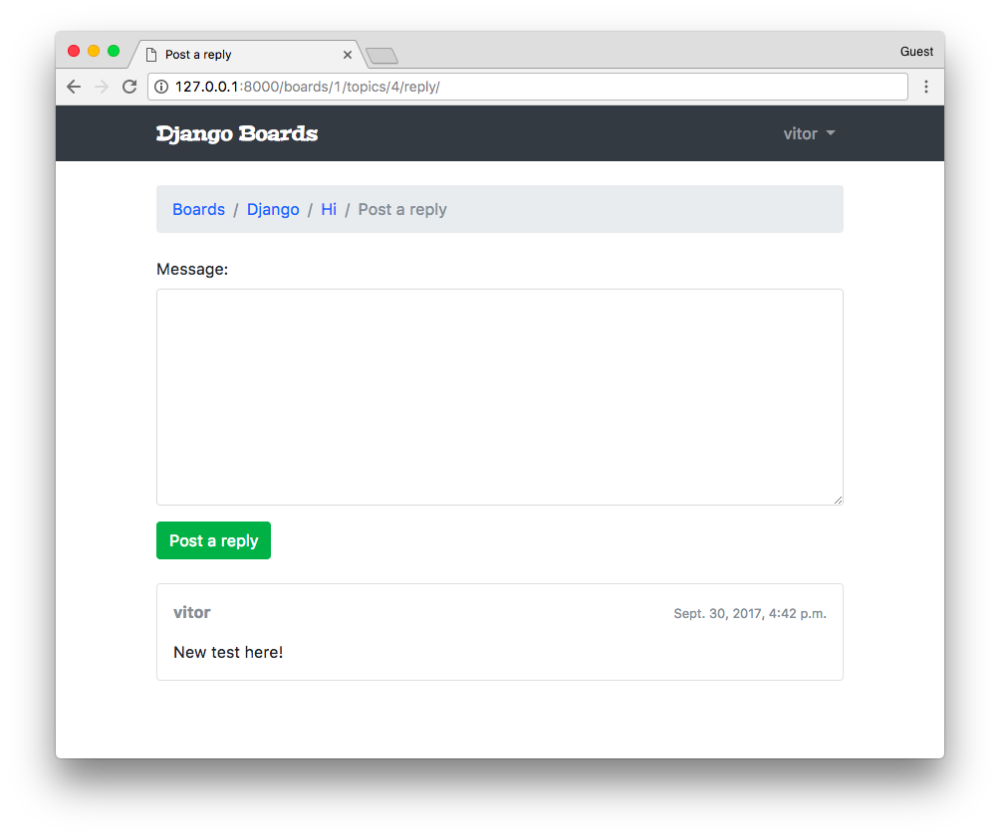
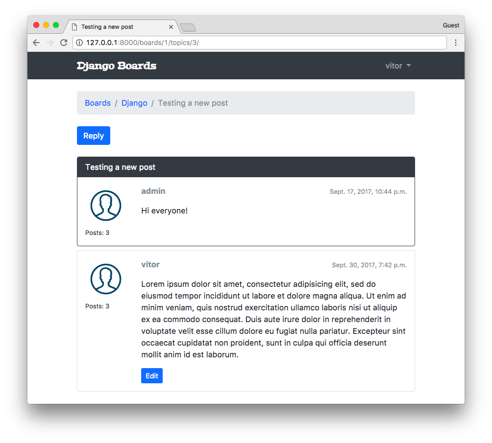

# Django入门与实践-第19章：主题回复

现在让我们来实现回复帖子的功能，以便我们可以添加更多的数据和改进功能实现与单元测试。


添加新的URL路由：

**myproject/urls.py**([完整代码](https://gist.github.com/vitorfs/71a5f9f39202edfbab9bacf11844548b#file-urls-py-L39))

```python
url(r'^boards/(?P<pk>\d+)/topics/(?P<topic_pk>\d+)/reply/$', views.reply_topic, name='reply_topic'),

```

给回帖创建一个新的表单：

**boards/forms.py** ([完整代码](https://gist.github.com/vitorfs/3dd5ed2b3e27b4c12886e9426acf8fda#file-forms-py-L20))

```python
from django import forms
from .models import Post

class PostForm(forms.ModelForm):
    class Meta:
        model = Post
        fields = ['message', ]
```

一个新的受`@login_required`保护的视图，以及简单的表单处理逻辑

**boards/views.py**([完整代码](https://gist.github.com/vitorfs/9e3811d9b11958b4106d99d9243efa71#file-views-py-L45))


```python
from django.contrib.auth.decorators import login_required
from django.shortcuts import get_object_or_404, redirect, render
from .forms import PostForm
from .models import Topic

@login_required
def reply_topic(request, pk, topic_pk):
    topic = get_object_or_404(Topic, board__pk=pk, pk=topic_pk)
    if request.method == 'POST':
        form = PostForm(request.POST)
        if form.is_valid():
            post = form.save(commit=False)
            post.topic = topic
            post.created_by = request.user
            post.save()
            return redirect('topic_posts', pk=pk, topic_pk=topic_pk)
    else:
        form = PostForm()
    return render(request, 'reply_topic.html', {'topic': topic, 'form': form})
```

现在我们再会到**new_topic**视图函数，更新重定向地址（标记为 **#TODO** 的地方）

```python
@login_required
def new_topic(request, pk):
    board = get_object_or_404(Board, pk=pk)
    if request.method == 'POST':
        form = NewTopicForm(request.POST)
        if form.is_valid():
            topic = form.save(commit=False)
            # code suppressed ...
            return redirect('topic_posts', pk=pk, topic_pk=topic.pk)  # <- here
    # code suppressed ...
```

值得注意的是：在视图函数**replay_topic**中，我们使用`topic_pk`，因为我们引用的是函数的关键字参数，而在**new_topic**视图中，我们使用的是`topic.pk`，因为`topic`是一个对象（Topic模型的实例对象），`.pk`是这个实例对象的一个属性，这两种细微的差别，其实区别很大，别搞混了。

回复页面模版的一个版本：

**templates/reply_topic.html**

```html





Post a reply


  <li class="breadcrumb-item"><a href="">Boards</a></li>
  <li class="breadcrumb-item"><a href="">{{ topic.board.name }}</a></li>
  <li class="breadcrumb-item"><a href="">{{ topic.subject }}</a></li>
  <li class="breadcrumb-item active">Post a reply</li>




  <form method="post" class="mb-4">
    
    
    <button type="submit" class="btn btn-success">Post a reply</button>
  </form>

  
    <div class="card mb-2">
      <div class="card-body p-3">
        <div class="row mb-3">
          <div class="col-6">
            <strong class="text-muted">{{ post.created_by.username }}</strong>
          </div>
          <div class="col-6 text-right">
            <small class="text-muted">{{ post.created_at }}</small>
          </div>
        </div>
        {{ post.message }}
      </div>
    </div>
  


```




提交回复之后，用户会跳回主题的回复列表：


我们可以改变第一条帖子的样式，使得它在页面上更突出：

**templates/topic_posts.html**([完整代码](https://gist.github.com/vitorfs/3e4ad94ac3ae9d72194af4006d4aeaff#file-topic_posts-html-L20))

```html


  <div class="card mb-2 border-dark">
    
      <div class="card-header text-white bg-dark py-2 px-3">{{ topic.subject }}</div>
    
    <div class="card-body p-3">
      <!-- code suppressed -->
    </div>
  </div>

```



现在对于测试，已经实现标准化流程了，就像我们迄今为止所做的一样。 在boards/tests 目录中创建一个新文件 **test_view_reply_topic.py**：

**boards/tests/test_view_reply_topic.py** ([完整代码](https://gist.github.com/vitorfs/7148fcb95075fb6641e638214b751cf1))

```python
from django.contrib.auth.models import User
from django.test import TestCase
from django.urls import reverse
from ..models import Board, Post, Topic
from ..views import reply_topic

class ReplyTopicTestCase(TestCase):
    '''
    Base test case to be used in all `reply_topic` view tests
    '''
    def setUp(self):
        self.board = Board.objects.create(name='Django', description='Django board.')
        self.username = 'john'
        self.password = '123'
        user = User.objects.create_user(username=self.username, email='john@doe.com', password=self.password)
        self.topic = Topic.objects.create(subject='Hello, world', board=self.board, starter=user)
        Post.objects.create(message='Lorem ipsum dolor sit amet', topic=self.topic, created_by=user)
        self.url = reverse('reply_topic', kwargs={'pk': self.board.pk, 'topic_pk': self.topic.pk})

class LoginRequiredReplyTopicTests(ReplyTopicTestCase):
    # ...

class ReplyTopicTests(ReplyTopicTestCase):
    # ...

class SuccessfulReplyTopicTests(ReplyTopicTestCase):
    # ...

class InvalidReplyTopicTests(ReplyTopicTestCase):
    # ...
```

这里的精髓在于自定义了测试用例基类**ReplyTopicTestCase**。然后所有四个类将继承这个测试用例。

首先，我们测试视图是否受`@login_required`装饰器保护，然后检查HTML输入，状态码。最后，我们测试一个有效和无效的表单提交。

