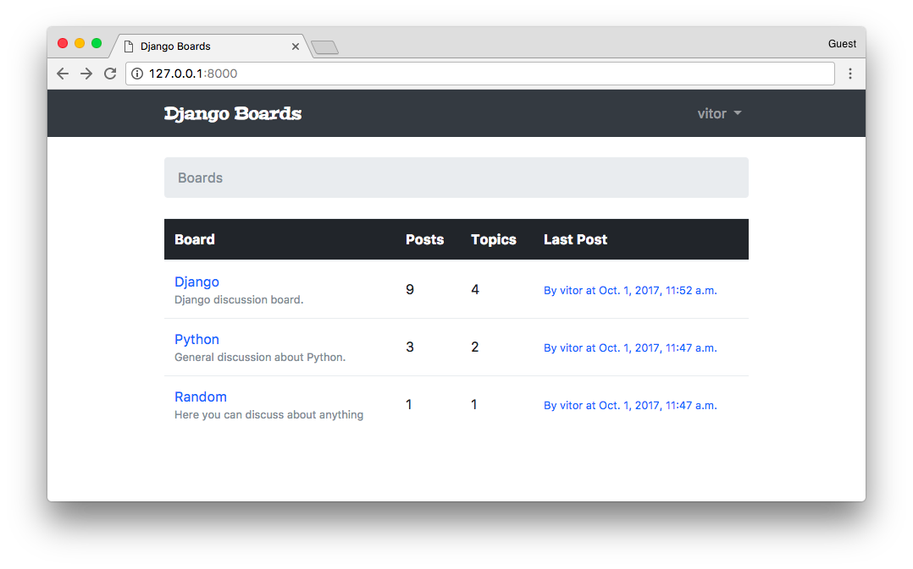
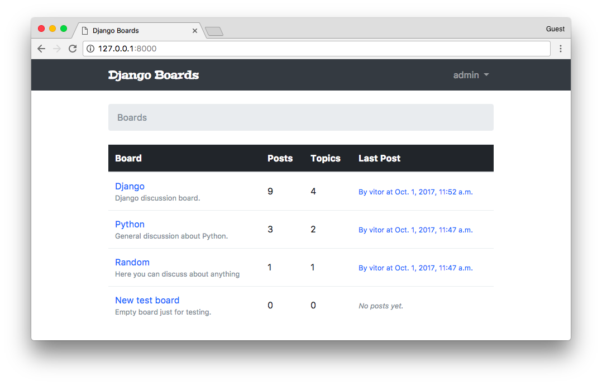
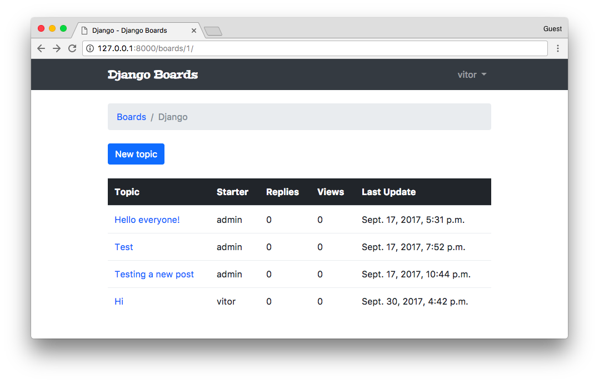

# Django入门与实践-第20章：QuerySets（查询结果集）

现在我们花点时间来探索关于模型的 API。首先，我们来改进主页：


有3个任务：

* 显示每个板块的总主题数
* 显示每个板块的总回复数
* 显示每个板块的最后发布者和日期

在实现这些功能前，我们先使用Python终端

因为我们要在Python终端尝试，所以，把所有的 models 定义一个 `__str__` 方法是个好主意

**boards/models.py**([完整代码](https://gist.github.com/vitorfs/9524eb42005697fbb79836285b50b1f4))

```python
from django.db import models
from django.utils.text import Truncator

class Board(models.Model):
    # ...
    def __str__(self):
        return self.name

class Topic(models.Model):
    # ...
    def __str__(self):
        return self.subject

class Post(models.Model):
    # ...
    def __str__(self):
        truncated_message = Truncator(self.message)
        return truncated_message.chars(30)
```

在 Post 模型中，使用了 `Truncator` 工具类，这是将一个长字符串截取为任意长度字符的简便方法（这里我们使用30个字符）

现在打开 Python shell 

```shell
python manage.py shell
from boards.models import Board

# First get a board instance from the database
board = Board.objects.get(name='Django')
```

这三个任务中最简单的一个就是获取当前版块的总主题数，因为 Topic 和 Baoard 是直接关联的。

```shell
board.topics.all()
<QuerySet [<Topic: Hello everyone!>, <Topic: Test>, <Topic: Testing a new post>, <Topic: Hi>]>

board.topics.count()
4
```

就这样子。

现在统计一个版块下面的回复数量有点麻烦，因为回复并没有和 Board 直接关联

```shell
from boards.models import Post

Post.objects.all()
<QuerySet [<Post: This is my first topic.. :-)>, <Post: test.>, <Post: Hi everyone!>,
  <Post: New test here!>, <Post: Testing the new reply feature!>, <Post: Lorem ipsum dolor sit amet,...>,
  <Post: hi there>, <Post: test>, <Post: Testing..>, <Post: some reply>, <Post: Random random.>
]>

Post.objects.count()
11
```

这里一共11个回复，但是它并不全部属于 "Django" 这个版块的。

我们可以这样来过滤

```shell
from boards.models import Board, Post

board = Board.objects.get(name='Django')

Post.objects.filter(topic__board=board)
<QuerySet [<Post: This is my first topic.. :-)>, <Post: test.>, <Post: hi there>,
  <Post: Hi everyone!>, <Post: Lorem ipsum dolor sit amet,...>, <Post: New test here!>,
  <Post: Testing the new reply feature!>
]>

Post.objects.filter(topic__board=board).count()
7
```

双下划线的`topic__board`用于通过模型关系来定位，在内部，Django 在 Board-Topic-Post之间构建了桥梁，构建SQL查询来获取属于指定版块下面的帖子回复。


最后一个任务是标识版块下面的最后一条回复

```shell
# order by the `created_at` field, getting the most recent first
Post.objects.filter(topic__board=board).order_by('-created_at')
<QuerySet [<Post: testing>, <Post: new post>, <Post: hi there>, <Post: Lorem ipsum dolor sit amet,...>,
  <Post: Testing the new reply feature!>, <Post: New test here!>, <Post: Hi everyone!>,
  <Post: test.>, <Post: This is my first topic.. :-)>
]>

# we can use the `first()` method to just grab the result that interest us
Post.objects.filter(topic__board=board).order_by('-created_at').first()
<Post: testing>
```

太棒了，现在我们来实现它

**boards/models.py** ([完整代码](https://gist.github.com/vitorfs/74077336decd75292082752eb8405ad3))

```python
from django.db import models

class Board(models.Model):
    name = models.CharField(max_length=30, unique=True)
    description = models.CharField(max_length=100)

    def __str__(self):
        return self.name

    def get_posts_count(self):
        return Post.objects.filter(topic__board=self).count()

    def get_last_post(self):
        return Post.objects.filter(topic__board=self).order_by('-created_at').first()
```

注意，我们使用的是`self`，因为这是Board的一个实例方法，所以我们就用这个Board实例来过滤这个 QuerySet

现在我们可以改进主页的HTML模板来显示这些新的信息

**templates/home.html**

```html




  <li class="breadcrumb-item active">Boards</li>



  <table class="table">
    <thead class="thead-inverse">
      <tr>
        <th>Board</th>
        <th>Posts</th>
        <th>Topics</th>
        <th>Last Post</th>
      </tr>
    </thead>
    <tbody>
      
        <tr>
          <td>
            <a href="">{{ board.name }}</a>
            <small class="text-muted d-block">{{ board.description }}</small>
          </td>
          <td class="align-middle">
            {{ board.get_posts_count }}
          </td>
          <td class="align-middle">
            {{ board.topics.count }}
          </td>
          <td class="align-middle">
            
              <small>
                <a href="">
                  By {{ post.created_by.username }} at {{ post.created_at }}
                </a>
              </small>
            
          </td>
        </tr>
      
    </tbody>
  </table>

```

现在是这样的效果



运行测试：
```shell
python manage.py test
```

```shell
Creating test database for alias 'default'...
System check identified no issues (0 silenced).
.......................................................EEE......................
======================================================================
ERROR: test_home_url_resolves_home_view (boards.tests.test_view_home.HomeTests)
----------------------------------------------------------------------
django.urls.exceptions.NoReverseMatch: Reverse for 'topic_posts' with arguments '(1, '')' not found. 1 pattern(s) tried: ['boards/(?P<pk>\\d+)/topics/(?P<topic_pk>\\d+)/$']

======================================================================
ERROR: test_home_view_contains_link_to_topics_page (boards.tests.test_view_home.HomeTests)
----------------------------------------------------------------------
django.urls.exceptions.NoReverseMatch: Reverse for 'topic_posts' with arguments '(1, '')' not found. 1 pattern(s) tried: ['boards/(?P<pk>\\d+)/topics/(?P<topic_pk>\\d+)/$']

======================================================================
ERROR: test_home_view_status_code (boards.tests.test_view_home.HomeTests)
----------------------------------------------------------------------
django.urls.exceptions.NoReverseMatch: Reverse for 'topic_posts' with arguments '(1, '')' not found. 1 pattern(s) tried: ['boards/(?P<pk>\\d+)/topics/(?P<topic_pk>\\d+)/$']

----------------------------------------------------------------------
Ran 80 tests in 5.663s

FAILED (errors=3)
Destroying test database for alias 'default'...
```


看起来好像有问题，如果没有回复的时候程序会崩溃

**templates/home.html**

```python

  
    <small>
      <a href="">
        By {{ post.created_by.username }} at {{ post.created_at }}
      </a>
    </small>
  
    <small class="text-muted">
      <em>No posts yet.</em>
    </small>
  

```

再次运行测试：

```shell
python manage.py test
```

```shell
Creating test database for alias 'default'...
System check identified no issues (0 silenced).
................................................................................
----------------------------------------------------------------------
Ran 80 tests in 5.630s

OK
Destroying test database for alias 'default'...
```


我添加一个没有任何消息的版块，用于检查这个"空消息"



现在是时候来改进回复列表页面了。



现在，我将告诉你另外一种方法来统计回复的数量，用一种更高效的方式

和之前一样，首先在Python shell 中尝试

```shell
python manage.py shell

```

```python
from django.db.models import Count
from boards.models import Board

board = Board.objects.get(name='Django')

topics = board.topics.order_by('-last_updated').annotate(replies=Count('posts'))

for topic in topics:
    print(topic.replies)

2
4
2
1
```


这里我们使用`annotate` ，QuerySet将即时生成一个新的列，这个新的列，将被翻译成一个属性，可通过 `topic.replies`来访问，它包含了指定主题下的回复数。


我们来做一个小小的修复，因为回复里面不应该包括发起者的帖子


```python
topics = board.topics.order_by('-last_updated').annotate(replies=Count('posts') - 1)

for topic in topics:
    print(topic.replies)

1
3
1
0
```

很酷，对不对？

**boards/views.py** ([完整代码](https://gist.github.com/vitorfs/f22b493b3e076aba9351c9d98f547f5e#file-views-py-L14))

```python
from django.db.models import Count
from django.shortcuts import get_object_or_404, render
from .models import Board

def board_topics(request, pk):
    board = get_object_or_404(Board, pk=pk)
    topics = board.topics.order_by('-last_updated').annotate(replies=Count('posts') - 1)
    return render(request, 'topics.html', {'board': board, 'topics': topics})
```

**templates/topics.html**([完整代码](https://gist.github.com/vitorfs/1a2235f05f436c92025dc86028c22fc4#file-topics-html-L28))


```html


  <tr>
    <td><a href="">{{ topic.subject }}</a></td>
    <td>{{ topic.starter.username }}</td>
    <td>{{ topic.replies }}</td>
    <td>0</td>
    <td>{{ topic.last_updated }}</td>
  </tr>

```


下一步是修复主题的查看次数，但是，现在我们需要添加一个新的字段